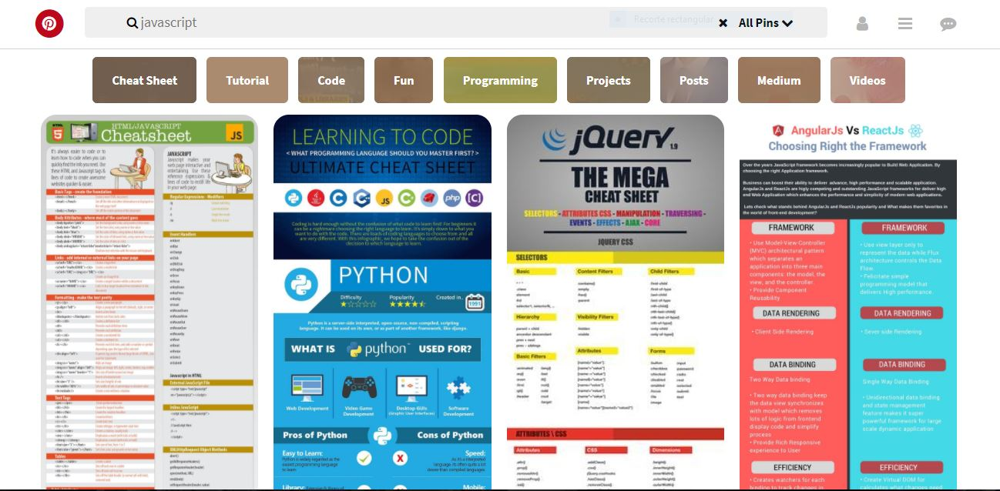
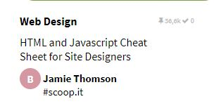
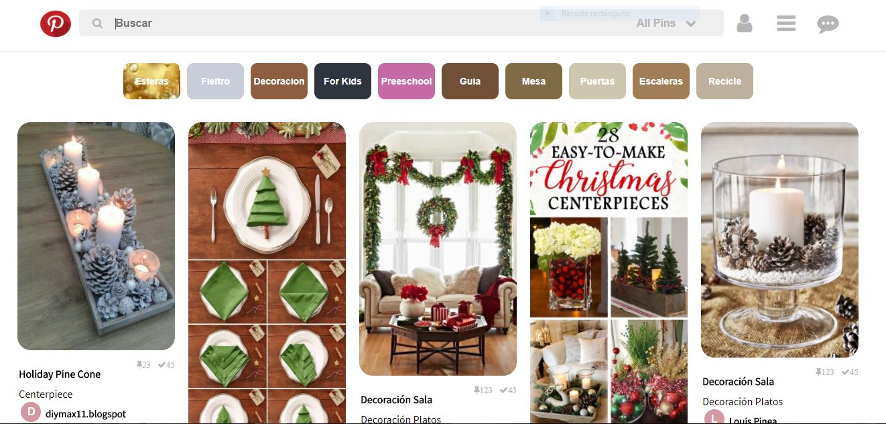

# Pinterest (maquetado)
***
La web Pinterest (maquetado) se ha creado desde cero incluyendo diversas imágenes y hojas de estilos CSS . Para este maquetado se ha utilizado solo 10 imágenes de prueba y una colección de iconos de Awesomeicon.

## Objetivo

El reto consiste en maquetar la web **Pinterest**, siguiendo una plantilla de modelo pero con la especificación de que las imágenes y el tema pueden ser de libre elección:

**Tema Elegido "Decoration Christmas**

Los detalles se tomaran en cuenta sobre este modelo en el siguiente enlace : [Pinterest](https://laboratoria.github.io/pinterestify/)

## Detalles adicionales

- Encontrarás un archivo base `index.html` el cual contiene una estructura inicial del proyecto.

- En la carpeta `css` tendrás un archivo base `main.css` donde hay clases reutilizables.

- El encabezado debe permanecer estatico.

- Se debe tener en cuenta los siguientes detalles en el maquetado, tanto en los iconos ,texto y logo de letra inicial del usuario.

  

### Proyecto Terminado
  

  Desarrollado por Carla Centeno Ramos.
